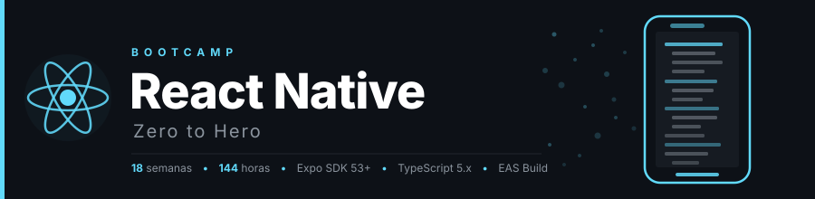

<p align="center">
  
</p>

<p align="center">
  <a href="LICENSE"></a>
  <a href="#"></a>
  <a href="#"></a>
  <a href="#"></a>
</p>

<p align="center">
  <a href="README.md"></a>
</p>

---

## 📋 Description

Intensive **18-week (~4.5 months)** bootcamp focused on mastering **React Native** and modern mobile app development with Expo. Designed to take developers with JavaScript/TypeScript and React experience to **Junior Mobile Developer**, with emphasis on clean code, best practices, and production-ready apps.

### 🎯 Objectives

Upon completion of the bootcamp, students will be able to:

- ✅ Master React Native and Expo fundamentals
- ✅ Build mobile interfaces with Core Components and Flexbox
- ✅ Implement complex navigation with React Navigation 7
- ✅ Manage global state with Zustand and server state with TanStack Query
- ✅ Consume REST APIs in a robust and typed way
- ✅ Handle forms with React Hook Form + Zod
- ✅ Implement local persistence and full authentication
- ✅ Create smooth animations with Reanimated 3 and Gesture Handler
- ✅ Access native APIs (camera, geolocation, notifications)
- ✅ Write automated tests with Jest, RNTL, and Maestro
- ✅ Optimize React Native app performance
- ✅ Publish to App Store and Google Play with EAS Build
- ✅ Implement CI/CD and OTA updates with EAS Update

### 🚀 Why React Native with Expo?

> **Modern React Native from day 1** — No legacy code, only current best practices.

React Native with Expo is the most productive stack for building cross-platform mobile apps with JavaScript. This bootcamp focuses exclusively on Expo SDK 53+ and React Native 0.79+, with TypeScript from day one. Students learn directly the tools and techniques they will use in the professional world.

---

## 🗓️ Bootcamp Structure

|         Stage          | Weeks  | Hours | Main Topics                                                |
| :--------------------: | :----: | :---: | ---------------------------------------------------------- |
| **RN Fundamentals**    |  1-2   |  16h  | Core Components, Flexbox, lists, inputs, styles            |
| **Core RN**            |  3-8   |  48h  | Navigation, Zustand, TanStack Query, forms, auth           |
| **Advanced**           |  9-14  |  48h  | Animations, native APIs, notifications, testing, perf      |
| **Production**         | 15-18  |  32h  | EAS Build, stores, CI/CD, OTA updates, final project       |

**Total: 18 weeks** | **144 hours** of intensive training

---

## 📚 Weekly Content

Each week includes:

```
bootcamp/week-XX-tema_principal/
├── README.md                 # Description and objectives
├── rubrica-evaluacion.md     # Evaluation criteria
├── 0-assets/                 # Images and diagrams
├── 1-teoria/                 # Theoretical material
├── 2-practicas/              # Guided exercises
├── 3-proyecto/               # Weekly project
├── 4-recursos/               # Additional resources
│   ├── ebooks-free/
│   ├── videografia/
│   └── webgrafia/
└── 5-glosario/               # Key terms
```

### 🔑 Key Components

- 📖 **Theory**: Fundamental concepts with real-world examples
- 💻 **Practice**: Progressive exercises and hands-on projects
- 📝 **Evaluation**: Knowledge, performance, and product evidence
- 🎓 **Resources**: Glossaries, references, and supplementary material

---

## 🛠️ Tech Stack

| Technology         | Version     | Usage                        |
| ------------------ | ----------- | ---------------------------- |
| React Native       | **0.79+**   | Mobile framework             |
| Expo SDK           | **53+**     | Development platform         |
| TypeScript         | **5.x**     | Main language                |
| React Navigation   | **7**       | Navigation                   |
| Zustand            | **5.x**     | Global state                 |
| TanStack Query     | **v5**      | Server state / cache         |
| React Hook Form    | **7.x**     | Forms                        |
| Zod                | **3.x**     | Schema validation            |
| Expo SecureStore   | **14.x**    | Secure storage               |
| Reanimated         | **3.x**     | Advanced animations          |
| Gesture Handler    | **2.x**     | Touch gestures               |
| EAS Build / Update | **latest**  | Build and OTA in production  |
| Jest + RNTL        | **29 / 12** | Unit testing                 |
| Maestro            | **1.x**     | E2E testing                  |
| pnpm               | **10.x**    | Package management           |

**Development environment**: Expo Go + iOS/Android simulators  
**Publishing**: App Store Connect + Google Play Console via EAS

---
## 🚀 Quick Start

### Prerequisites

- **Node.js 22+** installed
- **pnpm** as package manager (`npm install -g pnpm`)
- **Expo Go** on your physical device ([iOS](https://apps.apple.com/app/expo-go/id982107779) / [Android](https://play.google.com/store/apps/details?id=host.exp.exponent))
- **Git** for version control
- **VS Code** (recommended) with included extensions
- iOS simulator (Xcode) or Android emulator (Android Studio) for native features

### 1. Clone the Repository

```bash
git clone https://github.com/ergrato-dev/bc-reactnative.git
cd bc-reactnative
```

### 2. Install VS Code Extensions

```bash
# Open in VS Code
code .

# Recommended extensions will appear automatically
# Or run: Ctrl+Shift+P → "Extensions: Show Recommended Extensions"
```

### 3. Navigate to the Current Week

```bash
cd bootcamp/week-01-core_components_y_flexbox
```

### 4. Follow the Instructions

Each week contains a `README.md` with detailed instructions.

---

## 📊 Learning Methodology

### Teaching Strategies

- 🎯 **Project-Based Learning (PBL)**
- 🏛️ **Unique Domains**: Each learner applies concepts to their assigned domain (anti-copy policy)
- 🧩 **Deliberate Practice**
- 📱 **Mobile-First Thinking**
- 👥 **Peer Code Review**
- 🎮 **Live Coding**

### Time Distribution (8h/week)

- **Theory**: 2 hours
- **Practice**: 3-4 hours
- **Project**: 2-3 hours

### Evaluation

Each week includes three types of evidence:

1. **Knowledge 🧠** (30%): Theoretical assessments and quizzes
2. **Performance 💪** (40%): Practical exercises in class
3. **Product 📦** (30%): Evaluable deliverables (functional projects)

**Passing criteria**: Minimum 70% in each type of evidence. Coherent implementation consistent with the assigned domain. Originality: no copying among learners.

---

## 🏛️ Unique Domains Policy (Anti-Copy)

Each learner receives a **unique domain assigned by the instructor** from the first class, used across all bootcamp projects.

Domain examples: 📖 Library, 💊 Pharmacy, 🏋️ Gym, 🏫 School, 🏬 Pet Store, 🍽️ Restaurant, 🏦 Bank, 🚕 Taxi Agency, 🏥 Hospital, 🎥 Cinema, 🏞️ Hotel, ✈️ Travel Agency, 🏎️ Car Dealership, 👗 Clothing Store, 🛠️ Auto Repair Shop, and more.

**Objective:**

- ✅ Prevent copying between students
- ✅ Encourage original implementations
- ✅ Apply general concepts to specific contexts
- ✅ Develop abstraction and adaptation skills

**Instructor responsibilities:**

1. Assign a unique domain to each learner at the start
2. Maintain a record of assigned domains
3. Do not repeat domains within the same group
4. Validate domain coherence during evaluations

---

## 📞 Support

- 💬 **Discussions**: [GitHub Discussions](https://github.com/ergrato-dev/bc-reactnative/discussions)
- 🐛 **Issues**: [GitHub Issues](https://github.com/ergrato-dev/bc-reactnative/issues)

---

## ⚠️ Disclaimer

This repository is an **educational** resource created for learning purposes. By using it, you agree to the following terms:

- **Educational purposes only**: The content, code examples, and projects are designed exclusively for teaching and learning. They do not constitute professional, legal, or security advice.
- **No warranties**: The material is provided **"as is"**, without warranties of any kind, express or implied, including fitness for a particular purpose or freedom from errors.
- **Production code**: Code examples are illustrative. Before using them in production environments, you must perform security, performance, and context-specific reviews.
- **Software versions**: Library and tool versions mentioned may become outdated. Always consult the latest official documentation.
- **Limitation of liability**: The authors and contributors are not responsible for data loss, direct or indirect damages, service interruptions, or any other harm arising from the use of this material.
- **Student responsibility**: Each student is responsible for their own implementations, development environments, and technical decisions.

---

## 📄 License

This project is licensed under **[CC BY-NC-SA 4.0](https://creativecommons.org/licenses/by-nc-sa/4.0/)** (Creative Commons Attribution-NonCommercial-ShareAlike 4.0 International).

**You may:** share and adapt the material, including creating educational forks.<br>
**You may not:** use this material for commercial purposes.<br>
**You must:** give appropriate credit and distribute adaptations under the same license.

See the [LICENSE](LICENSE) file for the full text.

---

## 🏆 Acknowledgments

- [React Native](https://reactnative.dev/) — For the cross-platform mobile framework
- [Expo](https://expo.dev/) — For simplifying React Native development
- [React Navigation](https://reactnavigation.org/) — For the most complete navigation in the ecosystem
- [Software Mansion](https://swmansion.com/) — Creators of Reanimated and Gesture Handler
- React Native Community — For resources and examples
- All contributors

---

## 📚 Additional Documentation

- [🤖 Copilot Instructions](.github/copilot-instructions.md)
- [📜 Code of Conduct](CODE_OF_CONDUCT.md)
- [🔒 Security Policy](SECURITY.md)

---

<p align="center">
  <strong>🎓 React Native Bootcamp - Zero to Hero</strong><br>
  <em>From React developer to mobile developer in 4.5 months</em>
</p>

<p align="center">
  <a href="bootcamp/week-01-core_components_y_flexbox">Start Week 1</a> •
  <a href="docs">View Docs</a> •
  <a href="https://github.com/ergrato-dev/bc-reactnative/issues">Report Issue</a>
</p>

<p align="center">
  Made with ❤️ for the developer community
</p>
