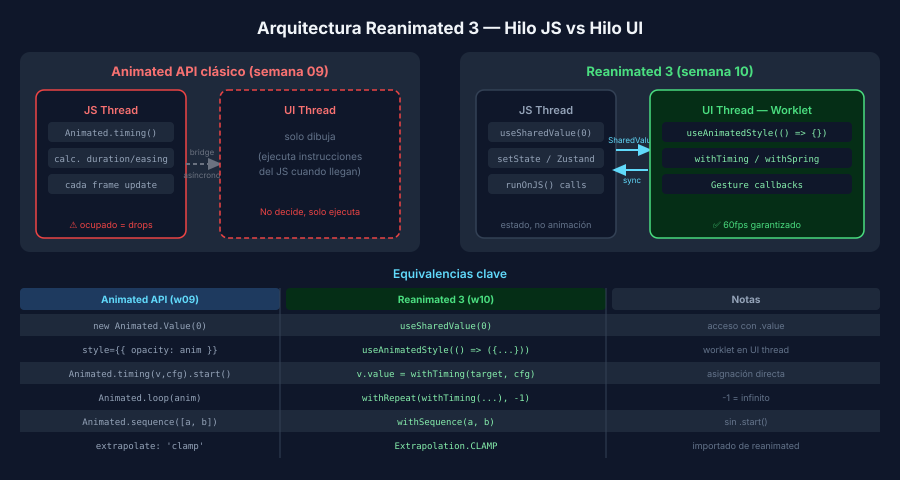

# Reanimated 3 — Fundamentos



## 🎯 Objetivos

- Entender por qué Reanimated 3 es más eficiente que el Animated API clásico
- Usar `useSharedValue` y `useAnimatedStyle` correctamente
- Aplicar `withTiming`, `withSpring`, `withRepeat` y `withSequence`

---

## 1. El problema del Animated API clásico

En la semana 09 aprendimos el `Animated API` de React Native. Su limitación principal:
aun con `useNativeDriver: true`, las _decisiones_ de animación (cuánto mover, cuándo parar)
siguen corriendo en el **hilo JavaScript**.

Si el hilo JS está ocupado procesando lógica de negocio o renderizando componentes,
las animaciones pueden perder fotogramas (frame drops).

```
Semana 09 — Animated con useNativeDriver: true
┌──────────────┐        bridge        ┌──────────────┐
│  JS Thread   │  ─── instrucciones →  │  UI Thread   │
│  (calcula)   │                       │  (dibuja)    │
└──────────────┘                       └──────────────┘
  ⚠️ Si el JS está ocupado → drops
```

**Reanimated 3** resuelve esto: toda la lógica de animación se ejecuta en un **worklet**
que corre directamente en el **hilo UI**, sin pasar por el bridge.

```
Semana 10 — Reanimated 3
┌──────────────┐                       ┌──────────────┐
│  JS Thread   │   SharedValue sync    │  UI Thread   │
│  (estado)    │  ◄──────────────────► │  (anima)     │
└──────────────┘                       └──────────────┘
  ✅ Animación no depende del JS thread → 60fps garantizado
```

---

## 2. SharedValue — el nuevo Animated.Value

`useSharedValue` crea un valor que se sincroniza automáticamente entre ambos hilos.

```tsx
import { useSharedValue } from 'react-native-reanimated';

// ✅ Reanimated 3 — se accede con .value, sin .current
const opacity = useSharedValue(0);
opacity.value = 1; // cambio instantáneo

// Comparación con w09:
// const opacity = useRef(new Animated.Value(0)).current;
```

> 🔑 Diferencia crucial: `sharedValue.value = newValue` asigna directamente.
> Para animar, asignar el resultado de `withTiming`, `withSpring`, etc.

---

## 3. useAnimatedStyle — estilos en el hilo UI

```tsx
import Animated, { useSharedValue, useAnimatedStyle, withTiming } from 'react-native-reanimated';

function FadeButton(): React.JSX.Element {
  const opacity = useSharedValue(0);

  // Este callback es un "worklet" → corre en UI thread
  const animatedStyle = useAnimatedStyle(() => ({
    opacity: opacity.value,
  }));

  useEffect(() => {
    // Asignar con withTiming → anima en lugar de saltar
    opacity.value = withTiming(1, { duration: 600 });
  }, [opacity]);

  // Usar Animated.View de Reanimated (no de React Native)
  return <Animated.View style={[styles.box, animatedStyle]} />;
}
```

---

## 4. withTiming — duración exacta

```tsx
import { withTiming, Easing } from 'react-native-reanimated';

// Animar a valor destino en 800ms con curva ease-out
opacity.value = withTiming(1, {
  duration: 800,
  easing: Easing.out(Easing.cubic),
});

// Con callback al terminar
opacity.value = withTiming(0, { duration: 300 }, (finished) => {
  // finished = true si terminó, false si fue cancelada
  if (finished) {
    runOnJS(setVisible)(false); // ← JS thread callback
  }
});
```

---

## 5. withSpring — física de resorte

En Reanimated 3 los parámetros son diferentes: `damping` y `stiffness` en lugar de `friction` y `tension`.

```tsx
import { withSpring } from 'react-native-reanimated';

scale.value = withSpring(1, {
  damping: 10,    // amortiguación (default: 10)
  stiffness: 100, // rigidez del resorte (default: 100)
  mass: 1,        // masa (default: 1) — mayor masa → más lento
});

// Equivalencia aproximada con Animated API:
// tension ≈ stiffness | friction ≈ damping
```

---

## 6. withRepeat — animaciones infinitas

`withRepeat` reemplaza `Animated.loop`. El segundo argumento es el número de repeticiones
(`-1` = infinito).

```tsx
import { withRepeat, withTiming } from 'react-native-reanimated';

// Spinner girando infinitamente
rotation.value = withRepeat(
  withTiming(360, { duration: 1000, easing: Easing.linear }),
  -1,      // -1 = infinito
  false,   // reverse: false (no vuelve al valor original entre repeticiones)
);
```

---

## 7. withSequence — animaciones encadenadas

```tsx
import { withSequence, withSpring } from 'react-native-reanimated';

// Bounce: sube → vuelve (ejecutado en orden)
translateY.value = withSequence(
  withSpring(-24, { damping: 8, stiffness: 200 }),
  withSpring(0,  { damping: 6, stiffness: 150 }),
);
```

---

## 8. interpolate — igual que en Animated, pero en UI thread

```tsx
import { interpolate, Extrapolation } from 'react-native-reanimated';

const animatedStyle = useAnimatedStyle(() => {
  const rotate = interpolate(
    progress.value,
    [0, 1],
    [0, 360],
    Extrapolation.CLAMP, // equivale a extrapolate: 'clamp'
  );
  return {
    transform: [{ rotate: `${rotate}deg` }],
  };
});
```

---

## ✅ Checklist de Verificación

- [ ] `babel.config.js` incluye `'react-native-reanimated/plugin'`
- [ ] `GestureHandlerRootView` envuelve la app en `App.tsx`
- [ ] `Animated` importado de `react-native-reanimated`, no de `react-native`
- [ ] `useAnimatedStyle` siempre retorna un objeto plano (solo estilo, sin lógica compleja)
- [ ] `withRepeat(..., -1)` para loops, no `Animated.loop`
