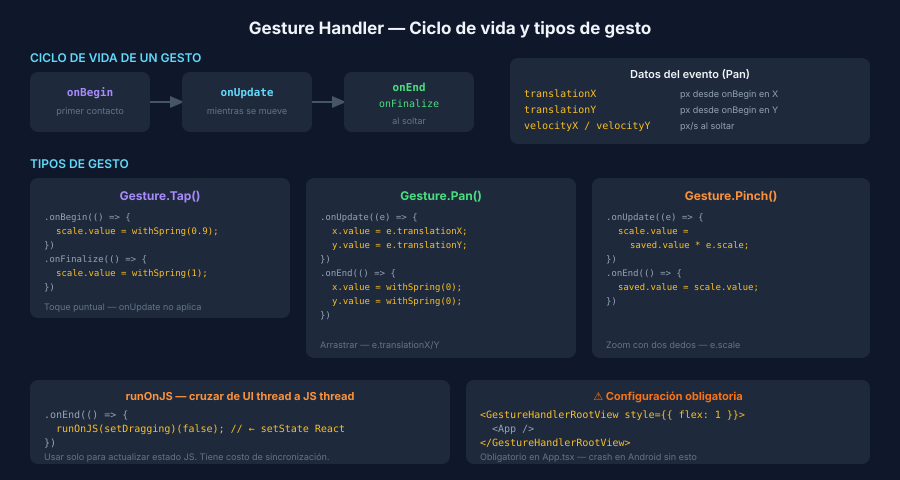

# Gesture Handler — Pan, Tap y runOnJS



## 🎯 Objetivos

- Configurar `GestureHandlerRootView` correctamente
- Implementar gestos tap y pan con `GestureDetector`
- Conectar gestos con `useSharedValue` para animaciones fluidas
- Entender `runOnJS` y cuándo es necesario

---

## 1. Setup — GestureHandlerRootView

`react-native-gesture-handler` requiere envolver toda la app en `GestureHandlerRootView`.
Sin esto, los gestos no funcionan en Android y pueden fallar en iOS.

```tsx
// App.tsx
import { GestureHandlerRootView } from 'react-native-gesture-handler';

export default function App(): React.JSX.Element {
  return (
    // flex: 1 es obligatorio en GestureHandlerRootView
    <GestureHandlerRootView style={{ flex: 1 }}>
      <QueryClientProvider client={queryClient}>
        <RootNavigator />
      </QueryClientProvider>
    </GestureHandlerRootView>
  );
}
```

---

## 2. GestureDetector + Gesture.Tap

`GestureDetector` aplica un gesto declarativo a su hijo único.

```tsx
import { GestureDetector, Gesture } from 'react-native-gesture-handler';
import Animated, { useSharedValue, useAnimatedStyle, withSpring } from 'react-native-reanimated';

function TapCard(): React.JSX.Element {
  const scale = useSharedValue(1);

  // Definir el gesto tap — los callbacks son worklets (UI thread)
  const tapGesture = Gesture.Tap()
    .onBegin(() => {
      scale.value = withSpring(0.93, { damping: 15, stiffness: 300 });
    })
    .onFinalize(() => {
      scale.value = withSpring(1, { damping: 10, stiffness: 200 });
    });

  const animatedStyle = useAnimatedStyle(() => ({
    transform: [{ scale: scale.value }],
  }));

  return (
    <GestureDetector gesture={tapGesture}>
      <Animated.View style={[styles.card, animatedStyle]}>
        <Text>Tócame</Text>
      </Animated.View>
    </GestureDetector>
  );
}
```

> 🔑 Los callbacks (`onBegin`, `onUpdate`, `onEnd`, `onFinalize`) son **worklets**.
> Corren en el hilo UI, por lo que pueden modificar `sharedValue.value` directamente.

---

## 3. Gesture.Pan — card arrastrable

`Gesture.Pan` entrega `translationX/Y` (desde el inicio del gesto) y
`velocityX/Y` (velocidad actual en px/s).

```tsx
function DraggableCard(): React.JSX.Element {
  const translateX = useSharedValue(0);
  const translateY = useSharedValue(0);

  const panGesture = Gesture.Pan()
    .onUpdate((event) => {
      // event.translationX/Y = desplazamiento desde onBegin
      translateX.value = event.translationX;
      translateY.value = event.translationY;
    })
    .onEnd(() => {
      // Snap-back al soltar
      translateX.value = withSpring(0);
      translateY.value = withSpring(0);
    });

  const animatedStyle = useAnimatedStyle(() => ({
    transform: [
      { translateX: translateX.value },
      { translateY: translateY.value },
    ],
  }));

  return (
    <GestureDetector gesture={panGesture}>
      <Animated.View style={[styles.card, animatedStyle]} />
    </GestureDetector>
  );
}
```

---

## 4. runOnJS — cruzar al hilo JS

Los worklets (callbacks de gesto, `useAnimatedStyle`) corren en el hilo UI.
Para actualizar **estado de React** (useState, Zustand, etc.) desde un gesto,
necesitas `runOnJS`.

```tsx
import { runOnJS } from 'react-native-reanimated';

const [isDragging, setIsDragging] = useState(false);

// ⚠️ setIsDragging es una función JS — no puede llamarse directo desde worklet
const panGesture = Gesture.Pan()
  .onBegin(() => {
    // runOnJS envuelve la llamada al hilo JS de forma segura
    runOnJS(setIsDragging)(true);
  })
  .onEnd(() => {
    translateX.value = withSpring(0);
    translateY.value = withSpring(0);
    runOnJS(setIsDragging)(false);
  });
```

> ⚠️ `runOnJS` tiene un costo de sincronización entre hilos. Úsalo solo cuando
> sea necesario actualizar estado React. Para animaciones puras, no es necesario.

---

## 5. Gesture.Pinch — zoom con dos dedos

```tsx
const scale = useSharedValue(1);
const savedScale = useSharedValue(1); // guarda el zoom entre gestos

const pinchGesture = Gesture.Pinch()
  .onUpdate((event) => {
    // event.scale = factor de zoom incremental desde el inicio del gesto
    scale.value = savedScale.value * event.scale;
  })
  .onEnd(() => {
    savedScale.value = scale.value;
  });

const animatedStyle = useAnimatedStyle(() => ({
  transform: [{ scale: scale.value }],
}));
```

---

## 6. Combinar gestos — Gesture.Simultaneous

Para permitir que dos gestos actúen al mismo tiempo (ej. pan + pinch):

```tsx
const composed = Gesture.Simultaneous(panGesture, pinchGesture);

return (
  <GestureDetector gesture={composed}>
    <Animated.View style={[styles.image, animatedStyle]} />
  </GestureDetector>
);
```

`Gesture.Race` activa solo el primero que reconoce. `Gesture.Exclusive` solo uno puede activarse.

---

## 7. Comparativa: w09 vs w10

| Concepto | Animated API (w09) | Reanimated 3 + GH (w10) |
|----------|-------------------|--------------------------|
| Valor animado | `useRef(new Animated.Value(0)).current` | `useSharedValue(0)` |
| Aplicar estilo | `style={{ opacity: anim }}` | `useAnimatedStyle(() => ({ opacity: sv.value }))` |
| Animar | `Animated.timing(v, cfg).start()` | `v.value = withTiming(target, cfg)` |
| Loop | `Animated.loop(Animated.timing(...))` | `withRepeat(withTiming(...), -1)` |
| Gesto | `PanResponder` (complicado) | `GestureDetector + Gesture.Pan()` |
| Thread | JS thread (con native driver parcial) | UI thread siempre |

---

## ✅ Checklist de Verificación

- [ ] `GestureHandlerRootView style={{ flex: 1 }}` envuelve toda la app
- [ ] `GestureDetector` tiene exactamente un hijo
- [ ] `runOnJS` usado solo para actualizar estado React desde gestos
- [ ] `savedScale` / `savedTranslation` para acumular gestos entre interacciones
- [ ] `Gesture.Simultaneous` cuando se combinan pan + pinch
