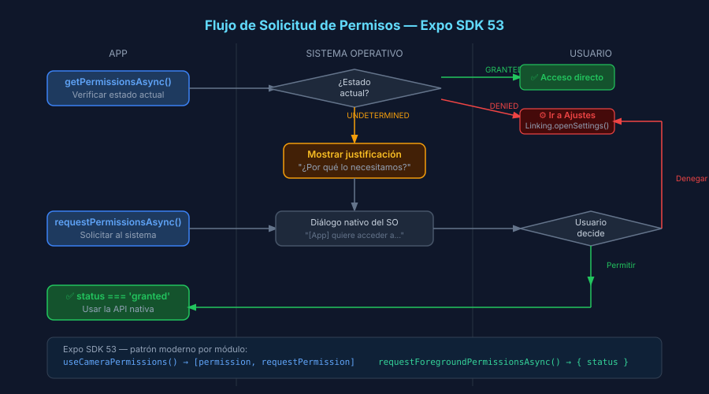

# Permisos y Cámara en Expo SDK 53

## 🎯 Objetivos

- Entender el ciclo de vida de permisos en iOS y Android
- Solicitar permisos con el patrón moderno de Expo SDK 53
- Usar `CameraView` para capturar fotos
- Seleccionar imágenes desde la galería con `expo-image-picker`

---

## 1. Sistema de Permisos en móvil

Los permisos protegen recursos sensibles del dispositivo (cámara, micrófono, ubicación).  
En React Native / Expo, cada módulo nativo gestiona sus propios permisos.



### Estados de permiso

```ts
import { PermissionStatus } from 'expo-camera';

// UNDETERMINED: nunca se ha preguntado al usuario
// GRANTED:      el usuario concedió acceso
// DENIED:       el usuario denegó acceso (puede ir a Ajustes)
```

### Declarar permisos en app.json (OBLIGATORIO)

Sin esta configuración, la app crashea en producción (EAS Build) o no solicita el permiso correctamente en iOS.

```json
{
  "expo": {
    "ios": {
      "infoPlist": {
        "NSCameraUsageDescription": "Necesitamos la cámara para fotografiar elementos de tu dominio.",
        "NSPhotoLibraryUsageDescription": "Necesitamos acceso a la galería para seleccionar imágenes."
      }
    },
    "android": {
      "permissions": ["CAMERA", "READ_MEDIA_IMAGES"]
    }
  }
}
```

---

## 2. expo-camera — CameraView y useCameraPermissions

### Patrón moderno con hook (Expo SDK 53)

```tsx
import { CameraView, useCameraPermissions } from 'expo-camera';

function CameraScreen(): React.JSX.Element {
  // useCameraPermissions devuelve [permissionObject, requestFn]
  // Similar al patrón de useState: [valor, actualizador]
  const [permission, requestPermission] = useCameraPermissions();

  // Mientras carga el estado del permiso
  if (!permission) {
    return <LoadingView />;
  }

  // Permiso denegado o no concedido: mostrar UI de solicitud
  if (!permission.granted) {
    return (
      <View style={styles.center}>
        <Text>Se necesita acceso a la cámara</Text>
        <Button title="Conceder permiso" onPress={requestPermission} />
      </View>
    );
  }

  // Permiso concedido: mostrar la cámara
  return (
    <CameraView style={{ flex: 1 }} facing="back">
      {/* Controles superpuestos en la cámara */}
    </CameraView>
  );
}
```

### Capturar una foto

```tsx
import { CameraView, useCameraPermissions } from 'expo-camera';
import { useRef } from 'react';

function CameraScreen(): React.JSX.Element {
  const [permission, requestPermission] = useCameraPermissions();
  const cameraRef = useRef<CameraView>(null);

  const takePicture = async () => {
    // takePictureAsync devuelve { uri, width, height, base64? }
    const photo = await cameraRef.current?.takePictureAsync({
      quality: 0.8,     // 0.0 (mínima) — 1.0 (máxima)
      base64: false,    // true solo si necesitas enviar por API sin archivo
    });
    if (photo) {
      console.log('URI de la foto:', photo.uri);
    }
  };

  if (!permission?.granted) return <PermissionView onRequest={requestPermission} />;

  return (
    <CameraView ref={cameraRef} style={{ flex: 1 }} facing="back">
      <Button title="📸 Tomar foto" onPress={takePicture} />
    </CameraView>
  );
}
```

---

## 3. expo-image-picker — Galería y cámara alternativa

`expo-image-picker` es útil cuando la cámara del simulador no está disponible o cuando el usuario necesita seleccionar imágenes existentes.

```tsx
import * as ImagePicker from 'expo-image-picker';

async function pickFromGallery(): Promise<string | null> {
  const result = await ImagePicker.launchImageLibraryAsync({
    mediaTypes: ['images'],         // solo imágenes (sin videos)
    allowsEditing: true,            // crop/recorte después de seleccionar
    aspect: [4, 3],                 // ratio del crop (solo iOS)
    quality: 0.8,
  });

  if (result.canceled) return null;

  // result.assets[0].uri contiene la URI local de la imagen seleccionada
  return result.assets[0].uri;
}

async function pickFromCamera(): Promise<string | null> {
  const result = await ImagePicker.launchCameraAsync({
    allowsEditing: true,
    quality: 0.8,
  });
  if (result.canceled) return null;
  return result.assets[0].uri;
}
```

---

## 4. Diferencias entre plataformas

| Comportamiento | iOS | Android |
|----------------|-----|---------|
| Cámara en Simulator | ❌ No disponible | ✅ Cámara virtual |
| Cámara en dispositivo físico | ✅ | ✅ |
| Galería en Simulator | ✅ (fotos del simulador) | ✅ |
| Permiso solo una vez | ✅ Recuerda elección | Puede resetear |
| Permiso denegado → Settings | Solo manual | `openSettings()` posible |

---

## ✅ Checklist de Verificación

- [ ] `NSCameraUsageDescription` declarado en `app.json` (iOS)
- [ ] `useCameraPermissions()` maneja los tres estados: `null`, `!granted`, `granted`
- [ ] `cameraRef.current?.takePictureAsync()` usa `?.` (puede ser null)
- [ ] `launchImageLibraryAsync` verifica `result.canceled` antes de usar `result.assets`
- [ ] En simulador iOS: usar `ImagePicker` como fallback de la cámara
