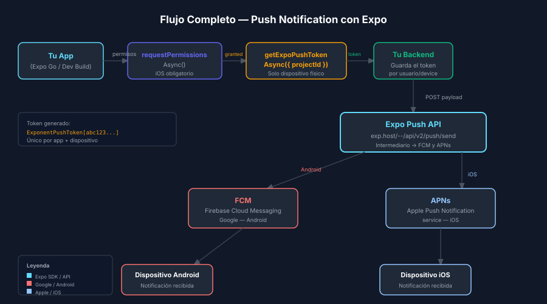

# Fundamentos de Push Notifications con Expo



## 🎯 Objetivos

- Conocer los tres tipos de notificaciones en React Native con Expo
- Configurar `expo-notifications` con los permisos correctos
- Implementar notificaciones locales y escuchar eventos

## 📋 Tipos de Notificaciones

| Tipo              | Descripción                                            | Servidor requerido |
| ----------------- | ------------------------------------------------------ | ------------------ |
| **Local**         | Programada por la propia app (alarma, recordatorio)    | ❌ No              |
| **Push (remota)** | Enviada desde un servidor externo                      | ✅ Sí              |
| **Silent push**   | Push sin UI, para sincronizar datos en background      | ✅ Sí              |

En esta semana trabajaremos **local** en los ejercicios y **push remota** en el proyecto.

---

## 1. Configuración de Permisos

### iOS — permiso obligatorio

En iOS el usuario SIEMPRE debe conceder permiso antes de mostrar notificaciones.
En Android 13+ también se requiere (anteriormente eran automáticos).

```ts
import * as Notifications from 'expo-notifications';

async function requestNotificationPermissions(): Promise<boolean> {
  // Solicita permiso al sistema operativo
  // En iOS muestra un diálogo nativo; en Android 13+ también
  const { status } = await Notifications.requestPermissionsAsync();

  if (status !== 'granted') {
    // El usuario rechazó los permisos — no podemos enviar notificaciones
    alert('Se necesitan permisos de notificaciones para usar esta función.');
    return false;
  }
  return true;
}
```

> 💡 **Diferencia con web**: en browsers usamos `Notification.requestPermission()`.
> En RN, `expo-notifications` abstrae las APIs nativas de iOS y Android.

---

## 2. Comportamiento en Foreground — `setNotificationHandler`

Por defecto, las notificaciones NO se muestran cuando la app está en primer plano.
Debemos configurar el handler en la **raíz de la app** (fuera de cualquier componente).

```ts
// App.tsx — fuera del componente, a nivel de módulo
Notifications.setNotificationHandler({
  handleNotification: async () => ({
    shouldShowAlert: true,   // Mostrar banner/alert visual
    shouldPlaySound: true,   // Reproducir sonido
    shouldSetBadge: false,   // Actualizar badge del icono (desactivado aquí)
  }),
});
```

> ⚠️ Si olvidas esto, las notificaciones en foreground no serán visibles.
> Es el error más común de principiantes con expo-notifications.

---

## 3. Notificaciones Locales

Las notificaciones locales NO requieren servidor ni internet. Son ideales para:
recordatorios, alarmas, timers o cualquier notificación generada por la propia app.

### Disparar inmediatamente

```ts
async function sendImmediateNotification(): Promise<void> {
  await Notifications.scheduleNotificationAsync({
    content: {
      title: '¡Nuevo pedido!',       // Título visible al usuario
      body: 'Tu pedido está listo.', // Cuerpo del mensaje
      data: { orderId: 'abc-123' },  // Datos extras para manejar el tap
      sound: true,
    },
    trigger: null, // null = disparar inmediatamente
  });
}
```

### Programar con delay (en segundos)

```ts
async function scheduleReminderIn5Seconds(): Promise<void> {
  await Notifications.scheduleNotificationAsync({
    content: {
      title: 'Recordatorio',
      body: 'No olvides revisar tus items pendientes.',
      data: { screen: 'Home' },
    },
    trigger: {
      type: Notifications.SchedulableTriggerInputTypes.TIME_INTERVAL,
      seconds: 5, // Disparar en 5 segundos
      repeats: false,
    },
  });
}
```

### Programar a una hora específica

```ts
async function scheduleDailyAt9AM(): Promise<void> {
  await Notifications.scheduleNotificationAsync({
    content: {
      title: 'Buenos días',
      body: 'Tienes 3 elementos pendientes hoy.',
    },
    trigger: {
      type: Notifications.SchedulableTriggerInputTypes.DAILY,
      hour: 9,
      minute: 0,
    },
  });
}
```

---

## 4. Escuchar Notificaciones — Listeners

Hay dos eventos distintos que debemos manejar:

| Listener                              | Cuándo se dispara                                          |
| ------------------------------------- | ---------------------------------------------------------- |
| `addNotificationReceivedListener`     | Cuando llega la notificación (app en foreground)           |
| `addNotificationResponseReceivedListener` | Cuando el usuario TAP en la notificación               |

```tsx
import { useEffect, useRef } from 'react';
import * as Notifications from 'expo-notifications';
import { Subscription } from 'expo-modules-core';

export function useNotificationListeners(): void {
  // useRef para guardar subscriptions sin re-renderizar
  const receivedSub = useRef<Subscription | null>(null);
  const responseSub = useRef<Subscription | null>(null);

  useEffect(() => {
    // Listener: notificación recibida mientras la app está abierta
    receivedSub.current = Notifications.addNotificationReceivedListener(
      (notification) => {
        console.log('Notification received:', notification.request.content.title);
        // Aquí puedes actualizar estado, mostrar un badge local, etc.
      }
    );

    // Listener: usuario tapea la notificación (desde cualquier estado)
    responseSub.current = Notifications.addNotificationResponseReceivedListener(
      (response) => {
        const data = response.notification.request.content.data;
        // Aquí navegamos o procesamos según los datos de la notificación
        console.log('User tapped notification, data:', data);
      }
    );

    // CLEANUP: obligatorio para evitar memory leaks
    // En React web usaríamos removeEventListener — aquí es .remove()
    return () => {
      receivedSub.current?.remove();
      responseSub.current?.remove();
    };
  }, []);
}
```

---

## 5. Cancelar Notificaciones Programadas

```ts
// Cancelar todas las notificaciones pendientes
await Notifications.cancelAllScheduledNotificationsAsync();

// Cancelar una notificación específica por ID
const notifId = await Notifications.scheduleNotificationAsync({...});
await Notifications.cancelScheduledNotificationAsync(notifId);

// Obtener todas las notificaciones pendientes
const pending = await Notifications.getAllScheduledNotificationsAsync();
console.log('Pending:', pending.length);
```

---

## ✅ Checklist de Verificación

- [ ] `setNotificationHandler` configurado a nivel de módulo en App.tsx
- [ ] `requestPermissionsAsync()` llamado antes de programar notificaciones
- [ ] Ambos listeners (`received` + `response`) implementados con cleanup
- [ ] `scheduleNotificationAsync` usa el trigger correcto para cada caso
- [ ] Cancelación limpia de notificaciones si el usuario desactiva recordatorios

## 📚 Recursos Adicionales

- [expo-notifications API Reference](https://docs.expo.dev/versions/latest/sdk/notifications/)
- [Expo notifications guide](https://docs.expo.dev/push-notifications/overview/)
