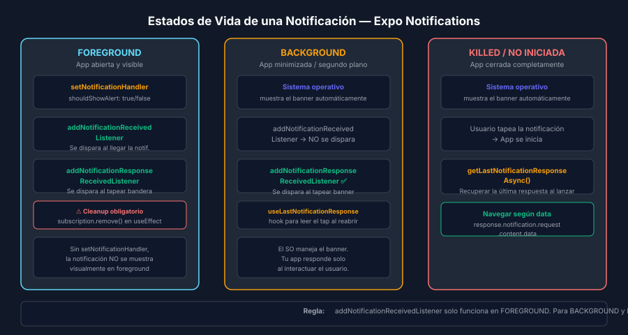

# Push Tokens y Expo Push API



## 🎯 Objetivos

- Obtener el Expo Push Token de un dispositivo físico
- Entender el flujo completo: app → backend → Expo Push API → FCM/APNs → dispositivo
- Conocer las limitaciones de Expo Go para push reales
- Enviar un push manual con la herramienta de prueba de Expo

## 📋 Arquitectura de Push Notifications

```
Tu App  →  Expo Push Token  →  Tu Backend
                                    ↓
                          Expo Push API (exp.host)
                                    ↓
                    FCM (Android) / APNs (iOS)
                                    ↓
                              Dispositivo físico
```

Expo actúa como intermediario entre tu backend y los servidores de Google (FCM)
y Apple (APNs), eliminando la necesidad de configurar ambos por separado.

---

## 1. Verificar que es un Dispositivo Físico

Los push tokens SÓLO se generan en dispositivos físicos. En simuladores,
`getExpoPushTokenAsync` fallará o devolverá un token inválido.

```ts
import * as Device from 'expo-device';
import * as Notifications from 'expo-notifications';

async function checkPushTokenAvailability(): Promise<void> {
  // Device.isDevice es true en iPhone/Android real, false en simulador
  if (!Device.isDevice) {
    alert('Las push notifications requieren un dispositivo físico.');
    return;
  }
  // Continuar con el flujo de obtención de token...
}
```

> 💡 **Por qué**: los simuladores no tienen el ID único de APNs/FCM que
> identifica el dispositivo en la red de notificaciones push de Apple/Google.

---

## 2. Obtener el Expo Push Token

```ts
import Constants from 'expo-constants';

async function registerForPushNotifications(): Promise<string | null> {
  if (!Device.isDevice) {
    console.warn('Push notifications require a physical device');
    return null;
  }

  // iOS: solicitar permisos ANTES de pedir el token (obligatorio)
  const { status: existingStatus } = await Notifications.getPermissionsAsync();
  let finalStatus = existingStatus;

  if (existingStatus !== 'granted') {
    const { status } = await Notifications.requestPermissionsAsync();
    finalStatus = status;
  }

  if (finalStatus !== 'granted') {
    console.warn('Push notification permission denied');
    return null;
  }

  // Obtener el Expo Push Token — requiere projectId del proyecto EAS
  // El projectId se encuentra en app.json bajo extra.eas.projectId
  const projectId =
    Constants.expoConfig?.extra?.eas?.projectId ??
    Constants.easConfig?.projectId;

  if (!projectId) {
    console.error('Project ID not found — configure EAS in app.json');
    return null;
  }

  const pushTokenData = await Notifications.getExpoPushTokenAsync({ projectId });
  // Formato: ExponentPushToken[xxxxxxxxxxxxxxxxxxxxxx]
  return pushTokenData.data;
}
```

> ⚠️ El `projectId` se obtiene ejecutando `eas init` y aparece en
> `app.json` bajo `expo.extra.eas.projectId`.

---

## 3. Configurar app.json para Push Notifications

```json
{
  "expo": {
    "name": "MiApp",
    "slug": "mi-app",
    "extra": {
      "eas": {
        "projectId": "tu-project-id-de-eas"
      }
    },
    "android": {
      "googleServicesFile": "./google-services.json",
      "permissions": ["NOTIFICATIONS", "RECEIVE_BOOT_COMPLETED", "VIBRATE"]
    },
    "ios": {
      "bundleIdentifier": "com.tuempresa.miapp"
    },
    "plugins": [
      [
        "expo-notifications",
        {
          "icon": "./assets/notification-icon.png",
          "color": "#61DAFB"
        }
      ]
    ]
  }
}
```

---

## 4. Enviar Push desde el Backend

El formato del payload de la Expo Push API:

```ts
// Backend (Node.js / cualquier HTTP client)
const message = {
  to: 'ExponentPushToken[xxxxxxxxxxxxxxxxxxxxxx]', // token obtenido en paso 2
  sound: 'default',
  title: 'Nuevo mensaje',
  body: '¡Tienes un nuevo elemento en tu lista!',
  data: {
    // Datos extras accesibles en addNotificationResponseReceivedListener
    screen: 'Detail',
    itemId: '42',
  },
  badge: 1,
  priority: 'high', // 'default' | 'normal' | 'high'
};

const response = await fetch('https://exp.host/--/api/v2/push/send', {
  method: 'POST',
  headers: {
    'Accept': 'application/json',
    'Content-Type': 'application/json',
  },
  body: JSON.stringify(message),
});

const result = await response.json();
// result.data[0].status === 'ok' → enviado correctamente
// result.data[0].status === 'error' → ver result.data[0].message
console.log('Push send result:', result);
```

---

## 5. Limitaciones de Expo Go

| Característica                   | Expo Go       | Development Build | EAS Build (producción) |
| -------------------------------- | ------------- | ----------------- | ---------------------- |
| Notificaciones locales           | ✅            | ✅                | ✅                     |
| Expo Push Token (dispositivo)    | ⚠️ Expo token | ✅ Nativo         | ✅ Nativo              |
| Push reales FCM/APNs             | ❌            | ✅                | ✅                     |
| Acciones en notificación         | ❌            | ✅                | ✅                     |

> **Para el ejercicio 02**: podrás obtener el token con Expo Go en un dispositivo
> físico, pero para recibir push reales de un servidor externo necesitas
> un **Development Build** (`eas build --profile development`).

---

## 6. Herramienta de Prueba — Expo Push Tool

Para probar sin necesitar un backend:

1. Obtén tu `ExponentPushToken[...]` de la app
2. Ve a [https://expo.dev/notifications](https://expo.dev/notifications)
3. Pega el token, escribe título y cuerpo
4. Haz click en "Send notification"

O usa `curl` desde la terminal:

```bash
curl -H "Content-Type: application/json" \
  -d '{
    "to": "ExponentPushToken[TU_TOKEN_AQUI]",
    "title": "Test",
    "body": "¡Push de prueba desde terminal!"
  }' \
  https://exp.host/--/api/v2/push/send
```

---

## ✅ Checklist de Verificación

- [ ] `Device.isDevice` verificado antes de solicitar token
- [ ] `requestPermissionsAsync()` llamado en iOS antes de `getExpoPushTokenAsync`
- [ ] `projectId` configurado en `app.json` bajo `extra.eas.projectId`
- [ ] Token enviado al backend y almacenado por usuario
- [ ] Push recibido correctamente desde Expo Push Tool

## 📚 Recursos Adicionales

- [Expo Push Notifications Overview](https://docs.expo.dev/push-notifications/overview/)
- [expo-device API](https://docs.expo.dev/versions/latest/sdk/device/)
- [Expo Push Tool](https://expo.dev/notifications)
- [Expo Push API spec](https://docs.expo.dev/push-notifications/sending-notifications/)
