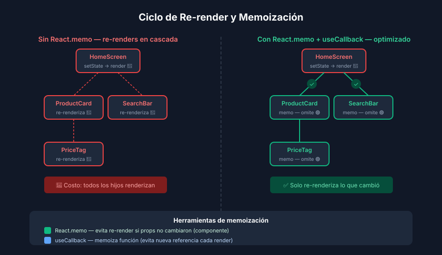

# React.memo, useMemo y useCallback

## 🎯 Objetivos

- Entender cuándo React re-renderiza un componente
- Aplicar `React.memo` para evitar re-renders de hijos
- Usar `useMemo` y `useCallback` para memoizar valores y funciones

---

## 1. ¿Por qué re-renderiza React?

Un componente se vuelve a renderizar cuando:

1. **Su propio estado cambia** (`useState`, `useReducer`)
2. **Sus props cambian** (por referencia, no solo por valor)
3. **Su contexto cambia** (`useContext`)
4. **Su componente padre se re-renderiza** ← el más frecuente e ignorado



En React web esto no suele ser problema. En React Native, cada render desencadena
trabajo en el **Bridge** (o JSI en RN 0.71+), lo que puede bajar los FPS.

---

## 2. React.memo

`React.memo` es un HOC que envuelve un componente y solo lo re-renderiza
si sus **props cambiaron** (comparación superficial — shallow equality).

```tsx
import React from 'react';
import { Text, View } from 'react-native';

interface ProductCardProps {
  name: string;
  price: number;
}

// Sin memo: se re-renderiza cada vez que el padre lo hace
function ProductCard({ name, price }: ProductCardProps): React.JSX.Element {
  console.log('Render ProductCard:', name); // para debug
  return (
    <View>
      <Text>{name}</Text>
      <Text>${price}</Text>
    </View>
  );
}

// Con memo: solo re-renderiza si name o price cambian
export default React.memo(ProductCard);
```

### ⚠️ Cuándo NO usar memo

- Componentes que siempre reciben props nuevas (sus props cambian en cada render)
- Componentes muy simples cuyo costo de comparación supera el de renderizar
- Cuando la prop es un objeto/función recreado en cada render del padre (ver useCallback)

---

## 3. useCallback

`useCallback` memoiza una **función** entre renders. Es esencial cuando pasas
callbacks como props a componentes envueltos en `React.memo`.

```tsx
import React, { useState, useCallback } from 'react';

function ProductList(): React.JSX.Element {
  const [cart, setCart] = useState<string[]>([]);

  // ❌ MAL: nueva función en cada render → rompe React.memo del hijo
  const handleAdd = (id: string) => {
    setCart((prev) => [...prev, id]);
  };

  // ✅ BIEN: misma referencia entre renders (mientras setCart no cambie)
  const handleAddMemo = useCallback((id: string) => {
    setCart((prev) => [...prev, id]);
  }, []); // ← dependencias vacías porque setCart es estable

  return <ProductCard onAdd={handleAddMemo} />;
}
```

### Regla de dependencias

El array `[]` funciona igual que en `useEffect`: incluir **todas las variables
del scope externo que usa la función**.

```tsx
const handleFilter = useCallback(() => {
  return products.filter((p) => p.category === selectedCategory);
}, [products, selectedCategory]); // ← products y selectedCategory son dependencias
```

---

## 4. useMemo

`useMemo` memoiza el **resultado de un cálculo**. Solo recalcula cuando cambian
las dependencias.

```tsx
import React, { useState, useMemo } from 'react';

function ProductScreen(): React.JSX.Element {
  const [products, setProducts] = useState<Product[]>([]);
  const [query, setQuery] = useState('');

  // ❌ MAL: se recalcula en cada render aunque products y query no cambien
  const filtered = products.filter((p) =>
    p.name.toLowerCase().includes(query.toLowerCase())
  );

  // ✅ BIEN: solo recalcula cuando products o query cambian
  const filteredMemo = useMemo(
    () =>
      products.filter((p) =>
        p.name.toLowerCase().includes(query.toLowerCase())
      ),
    [products, query]
  );

  return <FlatList data={filteredMemo} />;
}
```

### ⚠️ No usar useMemo para efectos secundarios

`useMemo` debe ser **puro**: sin llamadas a API, sin `setState`, sin mutaciones.
Para esas acciones, usa `useEffect`.

---

## 5. Patrón combinado

El combo `React.memo` + `useCallback` + `useMemo` es más efectivo juntos:

```
HomeScreen (padre)
├── filteredProducts = useMemo(...)       ← evita recalcular lista
├── handlePress = useCallback(...)         ← evita re-crear función
└── ProductCard = React.memo(...)         ← no re-renderiza si filteredProducts[i] no cambió
```

---

## ✅ Checklist de verificación

- [ ] Hay un `console.log('render')` en el componente hijo antes de memoizar
- [ ] `React.memo` aplicado al componente hijo
- [ ] El callback que se pasa como prop está envuelto en `useCallback`
- [ ] El `console.log` confirma que el hijo ya no re-renderiza al cambiar estado del padre
- [ ] `useMemo` aplicado a listas filtradas o cálculos derivados de state
- [ ] Las dependencias de `useMemo` y `useCallback` son correctas (sin array vacío falso)

## 📚 Recursos adicionales

- [React Docs — Skipping re-renders with memo](https://react.dev/reference/react/memo)
- [React Docs — useMemo](https://react.dev/reference/react/useMemo)
- [React Docs — useCallback](https://react.dev/reference/react/useCallback)
- [When to useMemo and useCallback — Kent C. Dodds](https://kentcdodds.com/blog/usememo-and-usecallback)
