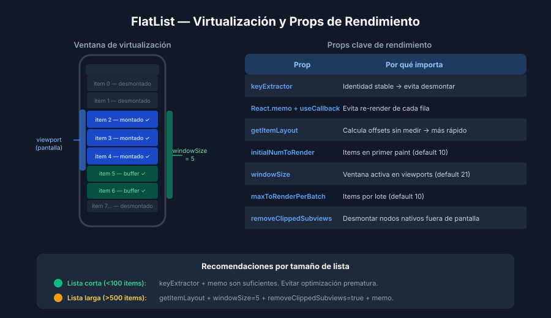

# FlatList — Optimización y Virtualización

## 🎯 Objetivos

- Comprender cómo FlatList virtualiza listas largas
- Aplicar props avanzadas para mejorar el scroll a 60 fps
- Memoizar `renderItem` y el componente de cada fila

---

## 1. ¿Qué es la virtualización?

`FlatList` no renderiza todos los items del array al mismo tiempo.
Solo monta los **elementos visibles en pantalla + un buffer** alrededor.
Los items fuera de la ventana se desmontan para liberar memoria.



Sin esta técnica, una lista de 1 000 items montaría 1 000 componentes en el árbol
de React desde el inicio, consumiendo CPU y RAM en exceso.

---

## 2. keyExtractor — siempre con IDs únicos

```tsx
// ❌ MAL: index no es estable cuando los datos cambian
<FlatList keyExtractor={(_, index) => String(index)} />

// ✅ BIEN: ID estable del modelo de datos
<FlatList keyExtractor={(item) => item.id} />
```

Una key inestable provoca que React desmonte y vuelva a montar items
aunque los datos no cambien, causando flashes y bajo rendimiento.

---

## 3. renderItem memoizado

```tsx
import React, { useCallback } from 'react';
import { ListRenderItem } from 'react-native';

interface Product { id: string; name: string; price: number; }

// Componente de fila memoizado con React.memo
const ProductRow = React.memo(function ProductRow({ item }: { item: Product }) {
  return <Text>{item.name} — ${item.price}</Text>;
});

// renderItem envuelto en useCallback para mantener la referencia
function ProductList({ products }: { products: Product[] }) {
  const renderItem: ListRenderItem<Product> = useCallback(
    ({ item }) => <ProductRow item={item} />,
    [] // ProductRow es estable porque está fuera del componente
  );

  return (
    <FlatList
      data={products}
      keyExtractor={(item) => item.id}
      renderItem={renderItem}
    />
  );
}
```

---

## 4. getItemLayout — listas de altura fija

Cuando todos los items tienen la **misma altura**, `getItemLayout` permite a FlatList
calcular posiciones sin medir cada elemento. Acelera enormemente el scroll largo.

```tsx
const ITEM_HEIGHT = 80; // px — debe ser exacto

<FlatList
  data={products}
  keyExtractor={(item) => item.id}
  getItemLayout={(_, index) => ({
    length: ITEM_HEIGHT,
    offset: ITEM_HEIGHT * index,
    index,
  })}
/>
```

Si los items tienen altura variable, usar `getItemLayout` causará posiciones incorrectas.
En ese caso, omitirlo y confiar en la medición automática.

---

## 5. Props de ventana de renderizado

```tsx
<FlatList
  data={largeList}
  keyExtractor={(item) => item.id}
  renderItem={renderItem}

  // Cuántos items renderizar en el primer ciclo (antes del scroll)
  initialNumToRender={10}

  // Tamaño de la ventana de items activos (múltiplo del viewport)
  // 5 = 2.5 pantallas arriba + pantalla actual + 2.5 abajo
  windowSize={5}

  // Cuántos items procesar por lote de renderizado
  maxToRenderPerBatch={10}

  // Milisegundos entre lotes de renderizado
  updateCellsBatchingPeriod={50}

  // Desmontar items fuera de la ventana (ahorra memoria, pero más trabajo al scroll)
  removeClippedSubviews={true}
/>
```

### Valores recomendados de partida

| Prop | Lista corta (<100) | Lista larga (>500) |
|------|--------------------|--------------------|
| `initialNumToRender` | 10 | 5-8 |
| `windowSize` | 10 (default) | 5 |
| `maxToRenderPerBatch` | 10 (default) | 8-12 |
| `removeClippedSubviews` | false | true |

---

## 6. Performance Monitor (Expo Go)

Para medir FPS en tiempo real durante el desarrollo:

```
Expo Go → Shake device → Performance Monitor
```

Muestra:
- **UI FPS**: frames por segundo del hilo UI (objetivo: 60 fps)
- **JS FPS**: frames del hilo JavaScript (puede bajar en listas con lógica pesada)
- **RAM**: consumo de memoria del proceso JS

Un scroll con FPS < 50 indica que `renderItem` es demasiado costoso.
Solución: aplicar `React.memo` al componente de fila y revisar cálculos en render.

---

## 7. Hermes — el motor JS de producción

[Hermes](https://hermesengine.dev/) es el motor JavaScript optimizado para React Native:
- Pre-compila JS a bytecode en tiempo de build → menor tiempo de arranque
- Menor uso de RAM que JSC (JavaScriptCore)
- Habilitado por defecto en Expo SDK 47+ en Android, SDK 48+ en iOS

```json
// app.json — verificar que Hermes esté habilitado
{
  "expo": {
    "jsEngine": "hermes"  // valor por defecto en Expo SDK 53
  }
}
```

---

## ✅ Checklist de verificación

- [ ] `keyExtractor` usa IDs únicos del modelo (no índices)
- [ ] Componente de fila exportado con `React.memo`
- [ ] `renderItem` declarado con `useCallback` fuera del JSX
- [ ] `getItemLayout` implementado si todos los items tienen altura fija
- [ ] `windowSize` ajustado a 5 en listas con > 200 items
- [ ] `removeClippedSubviews={true}` activado en listas largas
- [ ] Performance Monitor muestra > 58 UI FPS durante scroll continuo

## 📚 Recursos adicionales

- [React Native — FlatList docs](https://reactnative.dev/docs/flatlist)
- [React Native — Performance overview](https://reactnative.dev/docs/performance)
- [Optimizing FlatList Configuration — RN docs](https://reactnative.dev/docs/optimizing-flatlist-configuration)
- [Hermes engine](https://hermesengine.dev/)
