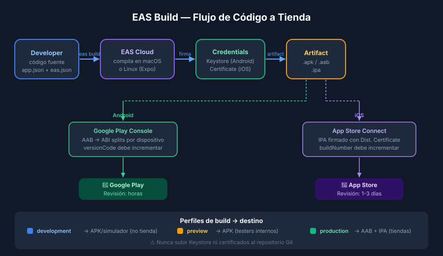
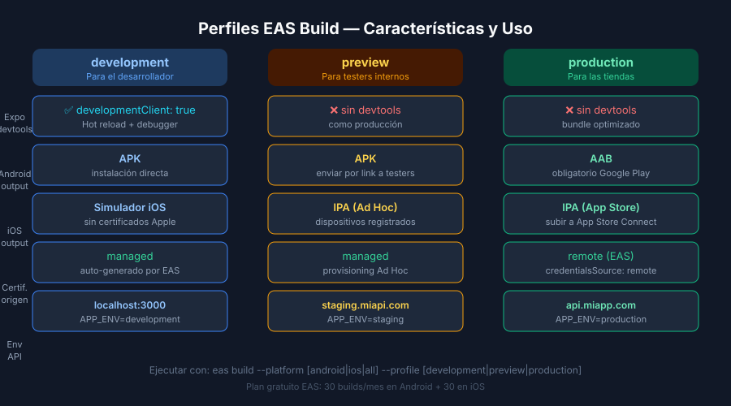

# EAS CLI y Perfiles de Build

## 🎯 Objetivos

- Instalar EAS CLI y autenticarse con una cuenta Expo
- Comprender la diferencia entre los tres perfiles de build
- Escribir un `eas.json` completo y correcto
- Ejecutar comandos de build básicos

---

## 1. ¿Qué es EAS Build?

**EAS (Expo Application Services)** es la infraestructura en la nube de Expo para:

- **EAS Build**: compila tu app en servidores de Expo → genera `.apk`, `.aab` o `.ipa`
- **EAS Submit**: sube el artifact generado a App Store Connect o Google Play
- **EAS Update**: envía actualizaciones OTA sin pasar por las tiendas



### ¿Por qué EAS y no `expo build` (deprecado)?

| Característica | `expo build` (legacy) | EAS Build |
|----------------|----------------------|-----------|
| Estado | Deprecado (2023) | Activo |
| Personalización | Limitada | Perfiles flexibles |
| Certificados | Solo managed | Managed + manual |
| Velocidad | Lenta | Más rápida |
| CLI | `expo-cli` | `eas-cli` |

---

## 2. Instalación y Login

```bash
# Instalar EAS CLI de forma global
pnpm add -g eas-cli

# Verificar instalación
eas --version

# Autenticarse con tu cuenta de expo.dev
eas login

# Inicializar EAS en el proyecto (crea eas.json)
eas init
```

> 💡 EAS es gratuito para builds de desarrollo e internos.
> Los builds de producción ilimitados requieren plan Pro.
> Para este bootcamp, el plan gratuito es suficiente.

---

## 3. Estructura de eas.json

```json
{
  "cli": {
    "version": ">= 16.0.0"
  },
  "build": {
    "development": { ... },
    "preview": { ... },
    "production": { ... }
  },
  "submit": {
    "production": { ... }
  }
}
```

---

## 4. Los tres perfiles de build



### development — Para desarrollo con simulador

```json
"development": {
  "developmentClient": true,
  "distribution": "internal",
  "ios": {
    "simulator": true
  },
  "android": {
    "buildType": "apk"
  },
  "env": {
    "APP_ENV": "development",
    "API_URL": "http://localhost:3000"
  }
}
```

- `developmentClient: true` → genera un **Expo development build** (no Expo Go)
- `distribution: "internal"` → no pasa por las tiendas, distribución directa
- `ios.simulator: true` → build para simulador iOS (sin certificados reales)
- `android.buildType: "apk"` → APK instalable directamente

### preview — Para testing con testers externos

```json
"preview": {
  "distribution": "internal",
  "ios": {
    "simulator": false
  },
  "android": {
    "buildType": "apk"
  },
  "env": {
    "APP_ENV": "staging",
    "API_URL": "https://staging.miapi.com"
  }
}
```

- Sin `developmentClient` → build estándar (como producción, sin devtools)
- APK en Android → fácil de instalar en dispositivos de testers
- iOS requiere dispositivos registrados en el Apple Developer Program

### production — Para las tiendas

```json
"production": {
  "android": {
    "buildType": "app-bundle"
  },
  "credentialsSource": "remote",
  "env": {
    "APP_ENV": "production",
    "API_URL": "https://api.miapp.com"
  }
}
```

- `buildType: "app-bundle"` → `.aab` requerido por Google Play (más eficiente que APK)
- `credentialsSource: "remote"` → EAS gestiona Keystore y certificados en su servidor
- iOS genera `.ipa` firmado con Distribution Certificate

---

## 5. Comandos principales

```bash
# Build para desarrollo en Android
eas build --platform android --profile development

# Build para preview en ambas plataformas
eas build --platform all --profile preview

# Build de producción en iOS
eas build --platform ios --profile production

# Ver lista de builds pasados
eas build:list

# Descargar el último build
eas build:download --latest

# Ver credenciales almacenadas en EAS
eas credentials
```

---

## 6. APK vs AAB

| Formato | Uso | Tamaño | Compatible con |
|---------|-----|--------|----------------|
| APK | Distribución directa / testing | Mayor | Android ≥ 5 |
| AAB | Google Play obligatorio desde 2021 | Menor en store | Google Play |

Google Play convierte el AAB en APKs optimizados para cada dispositivo (ABI splits).
Nunca subir un APK a Google Play en 2026 — rechazado automáticamente.

---

## ✅ Checklist de verificación

- [ ] `eas-cli` instalado: `eas --version` devuelve la versión
- [ ] `eas login` completado (sesión activa)
- [ ] `eas.json` tiene los 3 perfiles en el proyecto
- [ ] Perfil `development` tiene `developmentClient: true`
- [ ] Perfil `production` usa `app-bundle` en Android
- [ ] Variables de entorno diferenciadas por perfil en campo `env`

## 📚 Recursos adicionales

- [EAS Build docs](https://docs.expo.dev/build/introduction/)
- [eas.json reference](https://docs.expo.dev/eas/json/)
- [EAS Build profiles guide](https://docs.expo.dev/build/eas-json/)
