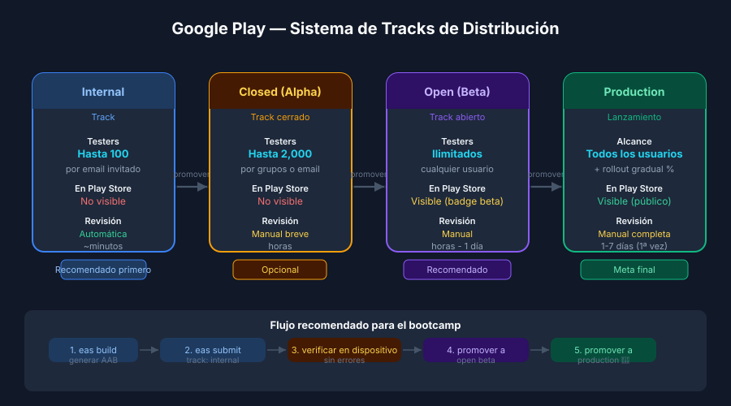

# Google Play Console — Tracks, Ratings y Store Listing

## 🎯 Objetivos

- Crear y configurar una ficha de app en Google Play Console
- Entender el sistema de tracks de distribución progresiva
- Configurar la clasificación de contenido por edad (IARC)
- Enviar un AAB mediante `eas submit` o manualmente

---

## 1. ¿Qué es Google Play Console?

**Google Play Console** (`play.google.com/console`) es el portal de Google para publicar
y gestionar apps en Google Play. Desde aquí se:

- Crean nuevas apps y se gestionan versiones
- Suben AAB a diferentes tracks de distribución
- Configuran metadatos del store listing
- Responde a reseñas y monitorea crashes (Android Vitals)
- Gestiona compras in-app y suscripciones

### Requisito previo
Una cuenta de **Google Play Developer** (25 USD — pago único). Sin ella no es posible publicar.

---

## 2. Crear una nueva app en Google Play Console

1. Ir a `play.google.com/console` → All apps → **Create app**
2. Completar el formulario inicial:

```
App name:         nombre visible en la tienda (máx. 30 chars)
Default language: Spanish (Mexico) [o tu idioma]
App or game:      App
Free or paid:     Free
```

3. Aceptar las políticas del programa de desarrolladores.
4. La app queda en modo borrador — requiere completar todas las secciones antes de poder publicar.

---

## 3. Sistema de Tracks — Distribución Progresiva

Google Play usa un sistema de **tracks** para lanzar apps de forma gradual y segura.



| Track | Testers | Visible en Play Store | Revisión humana |
|-------|---------|----------------------|-----------------|
| **Internal** | Hasta 100 (por email) | No | No (automática ~minutos) |
| **Closed (Alpha)** | Hasta 2000 (por grupo) | No | Sí (horas) |
| **Open (Beta)** | Ilimitados (público) | Sí (con badge "beta") | Sí |
| **Production** | Todos | Sí | Sí (días) |

### Flujo recomendado para el bootcamp

```
internal → (verificar que funciona) → open beta → production
```

> No es necesario pasar por todos los tracks. Se puede ir directo a `production`,
> pero los tracks previos permiten detectar errores antes del lanzamiento masivo.

---

## 4. Store Listing — Metadatos

### Campos principales

| Campo | Límite | Descripción |
|-------|--------|-------------|
| **App name** | 30 chars | Título principal en Play Store |
| **Short description** | 80 chars | Resumen visible antes de expandir |
| **Full description** | 4000 chars | Descripción completa con HTML básico |
| **App icon** | 512×512 px PNG | Ícono en alta resolución |
| **Feature graphic** | 1024×500 px | Banner en la parte superior del listing |
| **Screenshots** | Mín. 2, máx. 8 | Por factor de forma: phone, tablet, TV |

### Screenshots por tipo de dispositivo

- **Phone**: 320–3840 px en cualquier dimensión, ratio entre 16:9 y 9:16
- Formato: PNG o JPEG, máx. 8 MB por imagen
- Mínimo 2 capturas de teléfono para poder publicar

---

## 5. Clasificación de Contenido por Edad (IARC)

Google solicita completar el **cuestionario de clasificación de contenido** (IARC — International
Age Rating Coalition). El sistema asigna automáticamente la clasificación correcta según el
contenido declarado.

```
Categorías del cuestionario:
├── Violencia
├── Violencia gráfica
├── Contenido sexual
├── Lenguaje inapropiado
├── Juego de azar
├── Compras in-app dirigidas a menores
└── Información de localización compartida
```

Para la mayoría de apps del bootcamp (catálogos, listas, formularios): todo en "None" →
clasificación mínima (Everyone / 3+).

---

## 6. Política de Privacidad y Data Safety

Desde 2022, Google Play exige completar el formulario de **Data Safety** declarando:

- ¿La app recopila datos del usuario?
- ¿Cuáles datos? (localización, email, nombre, etc.)
- ¿Los datos se comparten con terceros?
- ¿Los datos se cifran en tránsito?

También es obligatorio proveer una **URL de política de privacidad** — funciona igual que en iOS.

---

## 7. Envío de AAB con EAS Submit

```json
// eas.json — sección submit
{
  "submit": {
    "production": {
      "android": {
        "serviceAccountKeyPath": "./secrets/service-account.json",
        "track": "internal"
      }
    }
  }
}
```

```bash
# Enviar el último AAB de producción al track 'internal'
eas submit --platform android --profile production --latest
```

### Service Account Key

Para que EAS pueda subir a Google Play automáticamente, se necesita un
**Service Account** con permisos de "Release Manager" en Google Play Console.

```
Google Play Console → Setup → API access → Link to Google Cloud Project
→ Create Service Account → Download JSON key
```

> El archivo `.json` del service account debe estar en `.gitignore` — es un secreto.

### Alternativa manual

Si no tienes Service Account configurado, puedes subir el AAB manualmente:

1. `eas build --platform android --profile production` → descarga el `.aab`
2. Google Play Console → app → Production → Create release → Upload the AAB

---

## 8. Revisión en Google Play

| Tiempo | Descripción |
|--------|-------------|
| **Internal track** | Automática, minutos |
| **Primera publicación** | 3-7 días (revisión manual completa) |
| **Actualizaciones** | Horas a 1-2 días |

Google revisa:
- Conformidad con las políticas del programa de desarrolladores
- Declaraciones de data safety vs comportamiento real de la app
- Permisos declarados vs permisos usados
- Clasificación de contenido correcta

---

## ✅ Checklist de verificación

- [ ] App creada en Google Play Console con `package` correcto
- [ ] Store listing completo: título, short desc, full desc, ícono, feature graphic
- [ ] Mínimo 2 screenshots de teléfono
- [ ] Cuestionario de clasificación de contenido IARC completado
- [ ] Data Safety formulario completado
- [ ] URL de política de privacidad configurada
- [ ] `eas.json` con sección `submit.production.android`
- [ ] Primer AAB subido (track internal o production)

## 📚 Recursos

- [Google Play Console Help](https://support.google.com/googleplay/android-developer)
- [Play Store listing guidelines](https://support.google.com/googleplay/android-developer/answer/9898842)
- [Data Safety section guide](https://support.google.com/googleplay/android-developer/answer/10787469)
- [EAS Submit — Android](https://docs.expo.dev/submit/android/)
