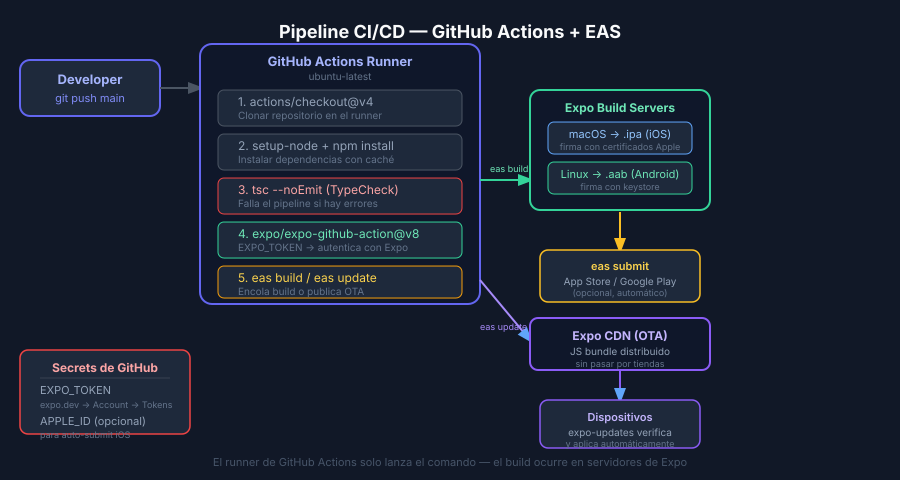

# CI/CD con GitHub Actions para React Native + EAS

## 🎯 Objetivos

- Entender qué es un pipeline CI/CD y por qué es crítico en apps móviles
- Configurar GitHub Actions para ejecutar `eas build` automáticamente
- Gestionar secretos de Expo en GitHub Actions de forma segura
- Distinguir jobs de CI (tests) vs CD (build/deploy)

---

## ¿Qué es CI/CD en el contexto móvil?

**CI (Continuous Integration)** — cada vez que un desarrollador hace push, se ejecutan
automáticamente: lint, typecheck, tests, y opcionalmente un build.

**CD (Continuous Delivery/Deployment)** — el build generado se distribuye automáticamente
a un ambiente: TestFlight (iOS), Google Play Internal (Android) o EAS Update (OTA).

En React Native con Expo, el flujo habitual es:

```
Push → GitHub Actions → eas build → (automáticamente) → eas submit
                      ↘ eas update (OTA) → canal staging/production
```

### ¿Por qué automatizar en mobile?

| Sin CI/CD | Con CI/CD |
|-----------|-----------|
| Build manual desde el laptop del developer | Build reproducible en servidor limpio |
| Olvidos frecuentes (typecheck, tests) | Todo se ejecuta siempre |
| Builds inconsistentes entre equipos | Un solo proceso verificado |
| Submit manual a tiendas | Automático en merge a main |

---

## Conceptos de GitHub Actions

### Workflow
Archivo YAML en `.github/workflows/` que define cuándo y qué ejecutar.

### Trigger (on)
Evento que activa el workflow:
```yaml
# Ejecutar en push a main
on:
  push:
    branches: [main]

# Ejecutar manualmente desde la UI de GitHub
  workflow_dispatch:

# Ejecutar en Pull Request (útil para CI)
  pull_request:
    branches: [main]
```

### Job
Unidad de trabajo que se ejecuta en un runner (máquina virtual de GitHub):
```yaml
jobs:
  build:
    runs-on: ubuntu-latest  # Linux, macOS, Windows disponibles
    steps:
      - ...
```

### Step
Acción individual dentro de un job. Puede ser un comando shell o una `action` reutilizable:
```yaml
steps:
  - name: Checkout code
    uses: actions/checkout@v4

  - name: Setup Node.js
    uses: actions/setup-node@v4
    with:
      node-version: 22.x
      cache: 'npm'

  - name: Install EAS CLI
    run: npm install -g eas-cli@latest

  - name: Build with EAS
    run: eas build --platform all --profile production --non-interactive
    env:
      EXPO_TOKEN: ${{ secrets.EXPO_TOKEN }}
```

### Secrets
Variables sensibles almacenadas en GitHub, nunca expuestas en logs.
Se agregan en: `Repository → Settings → Secrets and variables → Actions`.

---

## Configurar EXPO_TOKEN

EAS CLI necesita un token de acceso para autenticarse sin interacción manual.

**Paso 1: Generar el token**
```
expo.dev → Account Settings → Access Tokens → Create Token
```
Nombre sugerido: `github-actions-bc-reactnative`

**Paso 2: Agregar a GitHub Secrets**
```
GitHub repo → Settings → Secrets and variables → Actions → New repository secret
Name: EXPO_TOKEN
Secret: (pegar el token)
```

**Paso 3: Usar en el workflow**
```yaml
env:
  EXPO_TOKEN: ${{ secrets.EXPO_TOKEN }}
```

> El token nunca debe aparecer en texto plano en el workflow. Siempre usar `${{ secrets.NOMBRE }}`.

---

## Workflow Completo: eas-build.yml

```yaml
name: EAS Build

on:
  push:
    branches: [main]
  workflow_dispatch:

jobs:
  build:
    name: Build React Native app
    runs-on: ubuntu-latest

    steps:
      - name: Checkout repository
        uses: actions/checkout@v4

      - name: Setup Node.js 22
        uses: actions/setup-node@v4
        with:
          node-version: 22.x
          cache: 'npm'

      - name: Install dependencies
        run: npm install

      - name: Run TypeScript check
        run: npx tsc --noEmit

      - name: Setup Expo + EAS CLI
        uses: expo/expo-github-action@v8
        with:
          eas-version: latest
          token: ${{ secrets.EXPO_TOKEN }}

      - name: Build (iOS + Android)
        run: eas build --platform all --profile production --non-interactive
```

### Puntos clave del workflow

- `actions/checkout@v4` — clona el repositorio en el runner
- `actions/setup-node@v4` — instala Node.js 22 con caché de dependencias
- `expo/expo-github-action@v8` — instala EAS CLI y autentica automáticamente con `EXPO_TOKEN`
- `--non-interactive` — evita prompts que colgarían el workflow en CI

---

## Separar CI (tests) de CD (build)

Para proyectos más grandes, es útil separar los jobs:

```yaml
jobs:
  ci:
    name: Lint and TypeCheck
    runs-on: ubuntu-latest
    steps:
      - uses: actions/checkout@v4
      - uses: actions/setup-node@v4
        with: { node-version: 22.x, cache: 'npm' }
      - run: npm install
      - run: npx tsc --noEmit

  build:
    name: EAS Build
    runs-on: ubuntu-latest
    needs: ci            # Solo buildea si CI pasa
    if: github.ref == 'refs/heads/main'
    steps:
      - uses: actions/checkout@v4
      - uses: expo/expo-github-action@v8
        with: { eas-version: latest, token: '${{ secrets.EXPO_TOKEN }}' }
      - run: npm install
      - run: eas build --platform all --profile production --non-interactive
```

`needs: ci` garantiza que si TypeCheck o tests fallan, el build no se ejecuta.

---

## Diferencia entre runners iOS y Android

EAS Build corre en los servidores de Expo, **no en el runner de GitHub Actions**.
GitHub Actions solo ejecuta el comando `eas build`, que a su vez encola el trabajo en Expo.

```
GitHub Actions runner (ubuntu)        Expo Build Servers
│                                      │
│  eas build --platform ios   ─────→  │  macOS runner (firma .ipa)
│  eas build --platform android ────→ │  Linux runner (genera .aab)
│                                      │
│  Runner termina casi inmediato       │  Build puede tardar 10-30 min
```

Para esperar el resultado del build en el workflow: usar `--wait` (pero aumenta el tiempo de CI).

---

## Buenas Prácticas

- Siempre usar versiones fijas de actions: `actions/checkout@v4` (no `@latest`)
- Nunca hardcodear el `EXPO_TOKEN` en el YAML
- Usar `--non-interactive` en todos los comandos de EAS en CI
- Agregar `--no-wait` para builds rápidos (el build ocurre en background en Expo)
- Cachear `node_modules` con `cache: 'npm'` en `setup-node`

---

## ✅ Checklist de Verificación

- [ ] Archivo `.github/workflows/eas-build.yml` con sintaxis YAML válida
- [ ] `EXPO_TOKEN` en GitHub Secrets (nunca en el YAML)
- [ ] Trigger configurado (push a main + workflow_dispatch)
- [ ] Step de TypeCheck antes del build
- [ ] `--non-interactive` en comandos de EAS


