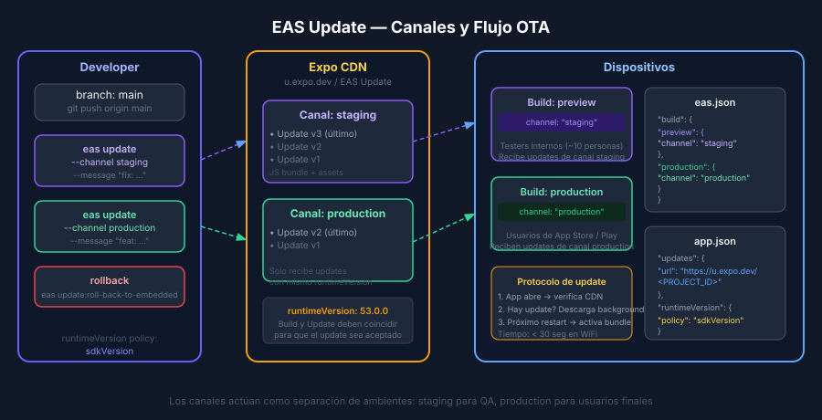

# EAS Update — OTA Updates y Gestión de Canales

## 🎯 Objetivos

- Entender qué es un OTA update y sus limitaciones técnicas
- Configurar `expo-updates` y canales en `eas.json`
- Publicar updates a canales `staging` y `production`
- Ejecutar un rollback cuando un update tiene un bug crítico

---

## ¿Qué es un OTA Update?

**OTA (Over-the-Air) Update** permite actualizar el código JavaScript y los assets de
una app ya publicada **sin pasar por la revisión de las tiendas**.

Cuando un usuario abre la app, `expo-updates` verifica si hay un nuevo update disponible
para su canal. Si hay uno compatible, lo descarga en background y lo aplica en el
próximo reinicio.

```
Developer → eas update → Expo CDN
                            ↓
Usuario abre app → expo-updates verifica → descarga bundle JS nuevo
                            ↓
Próximo restart → nueva versión activa
```

---

## ¿Qué puede actualizarse con OTA? ¿Qué no?

| Cambio | OTA Update | Nuevo Build |
|--------|-----------|-------------|
| Texto, colores, estilos | ✅ | — |
| Lógica de negocio (JS/TS) | ✅ | — |
| Imágenes y assets locales | ✅ | — |
| Nuevas pantallas (JS only) | ✅ | — |
| Nueva dependencia nativa | ❌ | ✅ |
| Cambio en `app.json` (permisos) | ❌ | ✅ |
| Nueva API nativa de Expo (camera, etc.) | ❌ | ✅ |
| Cambio de `bundleIdentifier` / `package` | ❌ | ✅ |
| Actualización de Expo SDK | ❌ | ✅ |

> **Regla**: si el cambio requiere código nativo (Swift/Obj-C, Kotlin/Java), necesita nuevo build.

---

## Runtime Version

El campo `runtimeVersion` especifica qué versión del **código nativo** es compatible
con un determinado update. EAS Update solo entrega un update si el `runtimeVersion`
del update coincide con el del build instalado.

```json
// app.json — política recomendada para el bootcamp
{
  "expo": {
    "runtimeVersion": {
      "policy": "sdkVersion"
    }
  }
}
```

### Políticas disponibles

| Policy | Comportamiento |
|--------|---------------|
| `sdkVersion` | runtimeVersion = versión del Expo SDK (ej. `53.0.0`) |
| `nativeVersion` | runtimeVersion = versión de la app (versionCode/buildNumber) |
| `appVersion` | runtimeVersion = campo `version` del app.json |
| Manual (`"1.0.0"`) | Se define manualmente — más control, más mantenimiento |

Para el bootcamp, `sdkVersion` es lo más simple: cambia solo cuando actualizas el SDK.

---

## Canales (Channels)

Un **canal de EAS Update** es un nombre lógico que agrupa updates para un entorno
específico. Los builds se asocian a un canal; solo reciben updates publicados en ese canal.

```
Canal: staging  ←→  build de preview
Canal: production ←→  build de producción
```

### Configurar canales en eas.json

```json
{
  "build": {
    "preview": {
      "channel": "staging",
      "distribution": "internal"
    },
    "production": {
      "channel": "production",
      "credentialsSource": "remote"
    }
  }
}
```

### Configurar en app.json

```json
{
  "expo": {
    "updates": {
      "url": "https://u.expo.dev/TU-PROJECT-ID",
      "enabled": true,
      "fallbackToCacheTimeout": 0,
      "runtimeVersion": {
        "policy": "sdkVersion"
      }
    }
  }
}
```

El `url` se obtiene con `eas update:configure` o en expo.dev → Project → Updates.

---

## Instalar y Configurar expo-updates

```bash
# Instalar el paquete
npx expo install expo-updates

# Configurar automáticamente (actualiza app.json y eas.json)
eas update:configure
```

`eas update:configure` agrega:
- `expo.updates.url` con el project ID correcto
- `expo.runtimeVersion` con policy `sdkVersion`
- El campo `channel` en los perfiles de build de `eas.json`

---

## Publicar un OTA Update

```bash
# Publicar al canal staging (rama main)
eas update --branch main --channel staging --message "fix: correct item list display"

# Publicar al canal production
eas update --branch main --channel production --message "feat: add domain item search"

# Ver todos los updates publicados
eas update:list

# Ver updates de un canal específico
eas update:list --branch main
```

### Campos importantes de `eas update`

| Flag | Descripción |
|------|-------------|
| `--branch` | Rama de Git asociada al update |
| `--channel` | Canal destino (staging / production) |
| `--message` | Descripción del cambio (obligatorio en CI) |
| `--platform` | `ios`, `android` o `all` (default) |

---

## Rollback de un Update

Si un update tiene un bug crítico en producción:

```bash
# Ver lista de updates recientes
eas update:list --channel production

# Hacer rollback al update anterior
eas update:roll-back-to-embedded --channel production
# Este comando vuelve al JS del último build nativo

# O publicar el update anterior como nuevo update
eas update --branch main --channel production --message "revert: broken search"
# (después de hacer git revert del commit problemático)
```

### Flujo de emergencia

```
1. Detectar bug crítico en production
2. eas update:list --channel production  ← identificar el update bueno anterior
3. git revert <commit-problemático>
4. eas update --branch main --channel production --message "revert: ..."
5. Los usuarios recibirán el update en el próximo arranque de la app
```

---

## Verificar Updates en el Simulador

Para probar un OTA update en desarrollo:

```bash
# Crear un preview build que apunte al canal staging
eas build --profile preview --platform ios

# Instalar en simulador e instalar
eas build:run --latest --platform ios

# Publicar un update al canal staging
eas update --branch main --channel staging --message "test update"

# Abrir la app — en el próximo restart verás el nuevo JS
```

---

## Integrar EAS Update en GitHub Actions

```yaml
# .github/workflows/eas-update.yml
name: EAS Update (OTA)

on:
  push:
    branches: [main]

jobs:
  update:
    name: Publish OTA update to staging
    runs-on: ubuntu-latest
    steps:
      - uses: actions/checkout@v4

      - uses: actions/setup-node@v4
        with:
          node-version: 22.x
          cache: 'npm'

      - run: npm install

      - uses: expo/expo-github-action@v8
        with:
          eas-version: latest
          token: ${{ secrets.EXPO_TOKEN }}

      - name: Publish OTA update to staging
        run: |
          eas update \
            --branch ${{ github.ref_name }} \
            --channel staging \
            --message "Auto update from CI — ${{ github.sha }}" \
            --non-interactive
```

Cada push a `main` publica automáticamente un OTA update al canal `staging`.
El canal `production` se actualiza manualmente o a través de un release tag.

---

## ✅ Checklist de Verificación

- [ ] `expo-updates` instalado en el proyecto
- [ ] `expo.updates.url` configurado en `app.json` con el project ID correcto
- [ ] `runtimeVersion` con policy `sdkVersion` en `app.json`
- [ ] Perfiles en `eas.json` tienen campo `channel` (`staging`, `production`)
- [ ] Al menos un update publicado con `eas update`
- [ ] Workflow de GitHub Actions publica updates en push a main


